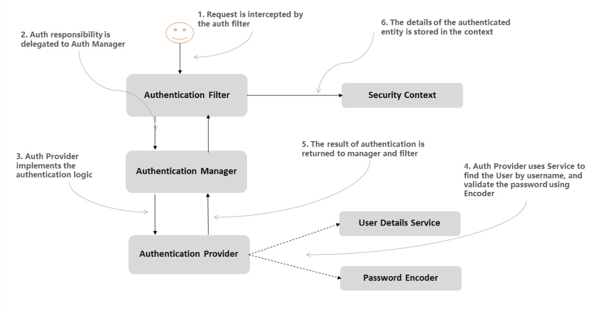

# Tenistas REST Spring Boot

Api REST de Tenistas con Spring Boot para acceso a Datos de 2º de DAM. Curso 2022/2023

[](https://kotlinlang.org/)
[](https://joseluisgs.dev/docs/license/)


- [Tenistas REST Spring Boot](#tenistas-rest-spring-boot)
  - [Descripción](#descripción)
    - [Advertencia](#advertencia)
    - [Tecnologías](#tecnologías)
  - [Dominio](#dominio)
    - [Representante](#representante)
    - [Raqueta](#raqueta)
    - [Tenista](#tenista)
    - [Usuario](#usuario)
  - [Proyectos y documentación anteriores](#proyectos-y-documentación-anteriores)
  - [Arquitectura](#arquitectura)
  - [Endpoints](#endpoints)
    - [Representantes](#representantes)
    - [Raquetas](#raquetas)
    - [Tenistas](#tenistas)
    - [Usuarios](#usuarios)
    - [Test](#test)
  - [Spring Boot](#spring-boot)
    - [Creando un proyecto](#creando-un-proyecto)
    - [Punto de Entrada](#punto-de-entrada)
    - [Parametrizando la aplicación](#parametrizando-la-aplicación)
    - [Componentes de Spring Boot](#componentes-de-spring-boot)
    - [IoC y DI en SpringBoot](#ioc-y-di-en-springboot)
    - [Spring Data JPA](#spring-data-jpa)
    - [Creando rutas](#creando-rutas)
      - [Comprensión de contenido](#comprensión-de-contenido)
      - [CORS](#cors)
    - [Responses](#responses)
      - [Paginación y ordenamiento](#paginación-y-ordenamiento)
    - [Requests](#requests)
      - [Parámetros de ruta](#parámetros-de-ruta)
      - [Parámetros de consulta](#parámetros-de-consulta)
      - [Peticiones datos serializados](#peticiones-datos-serializados)
      - [Peticiones con formularios](#peticiones-con-formularios)
      - [Peticiones multiparte](#peticiones-multiparte)
      - [Request validation](#request-validation)
    - [Excepciones personalizadas](#excepciones-personalizadas)
    - [Gestiones de Errores con Result](#gestiones-de-errores-con-result)
    - [WebSockets](#websockets)
    - [SSL y Certificados](#ssl-y-certificados)
    - [Autenticación y Autorización con JWT](#autenticación-y-autorización-con-jwt)
    - [Testing](#testing)
    - [Despliegue](#despliegue)
      - [JAR](#jar)
      - [Aplicación](#aplicación)
      - [Docker](#docker)
    - [Documentación](#documentación)
  - [Reactividad](#reactividad)
  - [Inmutabilidad](#inmutabilidad)
  - [Caché](#caché)
  - [Notificaciones en tiempo real](#notificaciones-en-tiempo-real)
  - [Proveedor de Dependencias](#proveedor-de-dependencias)
  - [Railway Oriented Programming](#railway-oriented-programming)
  - [Seguridad de las comunicaciones](#seguridad-de-las-comunicaciones)
    - [SSL/TLS](#ssltls)
    - [Autenticación y Autorización con JWT](#autenticación-y-autorización-con-jwt-1)
    - [CORS](#cors-1)
    - [BCrypt](#bcrypt)
  - [Testing](#testing-1)
    - [Postman](#postman)
  - [Distribución y Despliegue](#distribución-y-despliegue)
  - [Documentación](#documentación-1)
  - [Recursos](#recursos)
  - [Autor](#autor)
    - [Contacto](#contacto)
    - [¿Un café?](#un-café)
  - [Licencia de uso](#licencia-de-uso)

## Descripción

El siguiente proyecto es una API REST de Tenistas con Spring Boot para Acceso a Datos de 2º de DAM. Curso
2022/2023. En ella se pretende crear un servicio completo para la gestión de tenistas, raquetas y representantes de
marcas de raquetas.

El objetivo es que el alumnado aprenda a crear un servicio REST con Spring Boot, con las operaciones CRUD, securizar el
servicio con JWT y SSL y usar un cliente para consumir el servicio. Se pretende que el servicio completo sea asíncrono y
reactivo en lo máximo posible agilizando el servicio mediante una caché.

Además que permita escuchar cambios en tiempo real usando websocket

Se realizará inyección de dependencias y un sistema de logging.

Tendrá una página web de presentación como devolución de recursos estáticos.

Este proyecto tiene a su "gemelo" implementando en
Ktor: [tenistas-rest-ktor-2022-2023](https://github.com/joseluisgs/tenistas-rest-ktor-2022-2023)

### Advertencia

Esta API REST no está pensada para ser usada en producción. Es un proyecto de aprendizaje y por tanto algunas cosas no
se profundizan y otras están pensadas para poder realizarlas en clase de una manera más simple con el objetivo que el
alumnado pueda entenderlas mejor. No se trata de montar la mejor arquitectura o el mejor servicio, sino de aprender a
crear un servicio REST en el tiempo exigido por el calendario escolar.

Este proyecto está en constante evolución y se irán añadiendo nuevas funcionalidades y mejoras para el alumnado. De la
misma manera se irá completando la documentación asociada.

Si quieres colaborar, puedes hacerlo contactando [conmigo](#contacto).

### Tecnologías

- Servidor Web: [Spring Boot](https://spring.io/projects/spring-boot) - Framework para crear servicios usando Kotlin y
  Java como lenguaje.
- Autenticación: [JWT](https://jwt.io/) - JSON Web Token para la autenticación y autorización.
- Encriptado: [Bcrypt](https://en.wikipedia.org/wiki/Bcrypt) - Algoritmo de hash para encriptar contraseñas.
- Asincronía: [Coroutines](https://kotlinlang.org/docs/coroutines-overview.html) - Librería de Kotlin para la
  programación asíncrona.
- Reactividad: [Srping Reactive](https://spring.io/reactive) - Extensiones para reactividad en Spring Boot.
- Result: [Railway Oriented Programming](https://fsharpforfunandprofit.com/rop/) - Patrón de programación para el
  control de errores.
- Logger: [Kotlin Logging](https://github.com/MicroUtils/kotlin-logging) - Framework para la gestión de logs.
- Caché: Sistema de [caché](https://www.baeldung.com/spring-cache-tutorial) de Spring Boot.
- Base de datos: [H2](https://www.h2database.com/) - Base de datos relacional que te permite trabajar en memoria,
  fichero y servidor.
- Testing: [JUnit 5](https://junit.org/junit5/) - Framework para la realización de tests
  unitarios, [Mockk](https://mockk.io/) librería de Mocks para Kotlin, así como las propias herramientas de Spring Boot.
- Documentación: [Dokka](https://kotlinlang.org/docs/dokka-introduction.html) y [Swagger](https://swagger.io/) -
  Herramienta para la generación de documentación y pruebas de API REST respectivamente
  mediante [OpenAPI](https://www.openapis.org/).
- Cliente: [Postman](https://www.postman.com/) - Cliente para realizar peticiones HTTP.
- Contenedor: [Docker](https://www.docker.com/) - Plataforma para la creación y gestión de contenedores.


## Dominio

Gestionar tenistas, raquetas y representantes de marcas de raquetas. Sabemos que:

- Una raqueta tiene un representante y el representante es solo de una marca de raqueta (1-1). No puede haber raquetas
  sin representante y no puede haber representantes sin raquetas.
- Un tenista solo puede o no tener contrato con una raqueta y una raqueta o modelo de raqueta puede ser usada por varios
  tenistas (1-N). Puede haber tenistas sin raqueta y puede haber raquetas sin tenistas.
- Por otro lado tenemos usuarios con roles de administrador y usuarios que se pueden registrar, loguear consultar los
  datos y acceder a los datos de los usuarios (solo administradores).

### Representante

| Campo  | Tipo   | Descripción              |
|--------|--------|--------------------------|
| id     | UUID   | Identificador único      |
| nombre | String | Nombre del representante |
| email  | String | Email del representante  |

### Raqueta

| Campo         | Tipo          | Descripción                           |
|---------------|---------------|---------------------------------------|
| id            | UUID          | Identificador único                   |
| marca         | String        | Marca de la raqueta                   |
| precio        | Double        | Precio de la raqueta                  |
| representante | Representante | Representante de la raqueta (no nulo) |

### Tenista

| Campo           | Tipo      | Descripción                                    |
|-----------------|-----------|------------------------------------------------|
| id              | UUID      | Identificador único                            |
| nombre          | String    | Nombre del tenista                             |
| ranking         | Int       | Ranking del tenista                            |
| fechaNacimiento | LocalDate | Fecha de nacimiento del tenista                |
| añoProfesional  | Int       | Año en el que se convirtió en profesional      |
| altura          | Double    | Altura del tenista                             |
| peso            | Double    | Peso del tenista                               |
| manoDominante   | String    | Mano dominante del tenista (DERECHA/IZQUIERDA) |
| tipoReves       | String    | Tipo de revés del tenista (UNA_MANO/DOS_MANOS) |
| puntos          | Int       | Puntos del tenista                             |
| pais            | String    | País del tenista                               |
| raquetaID       | UUID      | Identificador de la raqueta (puede ser nulo)   |

### Usuario

| Campo    | Tipo   | Descripción                    |
|----------|--------|--------------------------------|
| id       | UUID   | Identificador único            |
| nombre   | String | Nombre del usuario             |
| email    | String | Email del usuario              |
| username | String | Rol del usuario                |
| password | String | Contraseña del usuario         |
| avatar   | String | Avatar del usuario             |
| rol      | Rol    | Rol del usuario (ADMIN o USER) |

## Proyectos y documentación anteriores

Parte de los contenidos a desarrollar en este proyecto se han desarrollado en proyectos anteriores. En este caso:

- [Kotlin-Ktor-REST-Service](https://github.com/joseluisgs/Kotlin-Ktor-REST-Service)
- [SpringBoot-Productos-REST-DAM-2021-2022](https://github.com/joseluisgs/SpringBoot-Productos-REST-DAM-2021-2022)

Para la parte de reactividad te recomiendo
leer: ["Ya no sé programar si no es reactivo"](https://joseluisgs.dev/blogs/2022/2022-12-06-ya-no-se-programar-sin-reactividad.html)

## Arquitectura

Nos centraremos en la arquitectura de la API REST. Para ello, usaremos el patrón de diseño MVC (Modelo Vista
Controlador) en capas.


## Endpoints

Recuerda que puedes conectarte de forma segura:

- Para la API REST: http://localhost:6969/api y https://localhost:6963/api
- Para la página web estática: http://localhost:6969/web y https://localhost:6963/web

Los endpoints que vamos a usar a nivel de api, parten de /api/ y puedes usarlos con tu cliente favorito. En este caso,
usaremos Postman:

### Representantes

| Método | Endpoint (/api)                        | Auth | Descripción                                             | Status Code (OK) | Content    |
|--------|----------------------------------------|------|---------------------------------------------------------|------------------|------------|
| GET    | /representantes                        | No   | Devuelve todos los representantes                       | 200              | JSON       |
| GET    | /representantes?page=X&size=Y&sortBy=Z | No   | Devuelve representantes paginados y ordenados por campo | 200              | JSON       |
| GET    | /representantes/{id}                   | No   | Devuelve un representante por su id                     | 200              | JSON       |
| POST   | /representantes                        | No   | Crea un nuevo representante                             | 201              | JSON       |
| PUT    | /representantes/{id}                   | No   | Actualiza un representante por su id                    | 200              | JSON       |
| DELETE | /representantes/{id}                   | No   | Elimina un representante por su id                      | 204              | No Content |
| GET    | /representantes/find?nombre=X          | No   | Devuelve los representantes con nombre X                | 200              | JSON       |
| WS     | /updates/representantes                | No   | Devuelve los cambios en representantes en tiempo real   | ---              | ---        |

### Raquetas

| Método | Endpoint (/api)                  | Auth | Descripción                                                              | Status Code (OK) | Content    |
|--------|----------------------------------|------|--------------------------------------------------------------------------|------------------|------------|
| GET    | /raquetas                        | No   | Devuelve todas las raquetas                                              | 200              | JSON       |
| GET    | /raquetas?page=X&size=Y&sortBy=Z | No   | Devuelve raquetas paginadas y ordenadas por campo                        | 200              | JSON       |
| GET    | /raquetas/{id}                   | No   | Devuelve una raqueta por su id                                           | 200              | JSON       |
| POST   | /raquetas                        | No   | Crea una nueva raqueta                                                   | 201              | JSON       |
| PUT    | /raquetas/{id}                   | No   | Actualiza una raqueta por su id                                          | 200              | JSON       |
| DELETE | /raquetas/{id}                   | No   | Elimina una raqueta por su id                                            | 204              | No Content |
| GET    | /raquetas/find?marca=X           | No   | Devuelve las raquetas con marca X                                        | 200              | JSON       |
| GET    | /raquetas/{id}/representante     | No   | Devuelve el representante de la raqueta dado su id                       | 200              | JSON       |
| WS     | /updates/raquetas                | No   | Websocket para notificaciones los cambios en las raquetas en tiempo real | ---              | JSON       |

### Tenistas

| Método | Endpoint (/api)                  | Auth | Descripción                                                              | Status Code (OK) | Content    |
|--------|----------------------------------|------|--------------------------------------------------------------------------|------------------|------------|
| GET    | /tenistas                        | No   | Devuelve todos los tenistas                                              | 200              | JSON       |
| GET    | /tenistas?page=X&size=Y&sortBy=Z | No   | Devuelve tenistas paginados y ordenadas por campo                        | 200              | JSON       |
| GET    | /tenistas/{id}                   | No   | Devuelve un tenista por su id                                            | 200              | JSON       |
| POST   | /tenistas                        | No   | Crea un nuevo tenista                                                    | 201              | JSON       |
| PUT    | /tenistas/{id}                   | No   | Actualiza un tenista por su id                                           | 200              | JSON       |
| DELETE | /tenistas/{id}                   | No   | Elimina un tenista por su id                                             | 204              | No Content |
| GET    | /tenistas/find?nombre=X          | No   | Devuelve los tenistas con nombre X                                       | 200              | JSON       |
| GET    | /tenistas/{id}/raqueta           | No   | Devuelve la raqueta del tenista dado su id                               | 200              | JSON       |
| GET    | /tenistas/ranking/{ranking}      | No   | Devuelve el tenista con ranking X                                        | 200              | JSON       |
| WS     | /updates/tenistas                | No   | Websocket para notificaciones los cambios en los tenistas en tiempo real | ---              | JSON       |


### Usuarios

| Método | Endpoint (/api) | Auth | Descripción                                                   | Status Code (OK) | Content |
|--------|-----------------|------|---------------------------------------------------------------|------------------|---------|
| POST   | /users/login    | No   | Login de un usuario, Token                                    | 200              | JSON    |
| POST   | /users/register | No   | Registro de un usuario                                        | 201              | JSON    |
| GET    | /users/me       | JWT  | Datos del usuario del token                                   | 200              | JSON    |
| PUT    | /users/me       | JWT  | Actualiza datos del usuario: nombre, e-mail y username        | 200              | JSON    |
| PATCH  | /users/me       | JWT  | Actualiza avatar del usuario como multipart                   | 200              | JSON    |
| GET    | /users/list     | JWT  | Devuelve todos los usuarios, si el token pertenece a un admin | 200              | JSON    |


### Test

| Método | Endpoint (/api) | Auth | Descripción                                                       | Status Code (OK) | Content    |
|--------|-----------------|------|-------------------------------------------------------------------|------------------|------------|
| GET    | /test?texto     | No   | Devuelve un JSON con datos de prueba y el texto de query opcional | 200              | JSON       |
| GET    | /test/{id}      | No   | Devuelve un JSON con datos de prueba por su id                    | 200              | JSON       |
| POST   | /test           | No   | Crea un nuevo JSON con datos de prueba                            | 201              | JSON       |
| PUT    | /test/{id}      | No   | Actualiza un JSON con datos de prueba por su id                   | 200              | JSON       |
| PATCH  | /test/{id}      | No   | Actualiza un JSON con datos de prueba por su id                   | 200              | JSON       |
| DELETE | /test/{id}      | No   | Elimina un JSON con datos de prueba por su id                     | 204              | No Content |

## Spring Boot

[Spring](https://spring.io/) es un framework de Java VM que nos permite crear aplicaciones web de forma rápida y
sencilla. En este caso, usaremos [Spring Boot](https://spring.io/projects/spring-boot), que es una versión simplificada
de Spring que nos ayuda en la configuración de sus elementos.

Se caracteriza por implementar el Contenedor
de [inversión de control](https://es.wikipedia.org/wiki/Inversi%C3%B3n_de_control): permite la configuración de los
componentes de aplicación y la administración del ciclo de vida de los objetos Java, se lleva a cabo principalmente a
través de la inyección de dependencias
y [programación orientada a aspectos](https://es.wikipedia.org/wiki/Programaci%C3%B3n_orientada_a_aspectos): habilita la
implementación de rutinas transversales.


### Creando un proyecto

Podemos crear un proyecto Spring Boot usando el plugin IntelliJ, desde su web. Con
estos [asistentes](https://start.spring.io/) podemos crear un proyecto Ktor con las opciones que queramos (plugins),
destacamos el routing, el uso de json, etc.

### Punto de Entrada

El servidor tiene su entrada y configuración en la clase Application. Esta lee la configuración en base
al [fichero de configuración](./src/main/resources/application.properties) y a partir de aquí se crea una instancia de
la
clase principal etiquetada con @SpringBootApplication

### Parametrizando la aplicación

La aplicación está parametrizada en el fichero de
configuración [application.properties](./src/main/resources/application.properties) que se encuentra en el directorio
resources. En este fichero podemos configurar el puerto, el modo de ejecución, etc.

Podemos tener distintos ficheros por ejemplo para desarrollo y producción.

Propiedades globales: src/main/resources/application.properties
Propiedades de producción: src/main/resources/application-prod.properties
Propiedades de desarrollo: src/main/resources/application-dev.properties
Y luego desde la línea de comandos podemos cargar un perfil concreto de la siguiente manera:

```bash
java -jar -Dspring.profiles.active=prod demo-0.0.1-SNAPSHOT.jar
```

```properties
server.port=${PORT:6963}
# Compresion de datos
server.compression.enabled=${COMPRESS_ENABLED:true}
server.compression.mime-types=text/html,text/xml,text/plain,text/css,application/json,application/javascript
server.compression.min-response-size=1024
# Configuramos el locale en España
spring.web.locale=es_ES
spring.web.locale-resolver=fixed
# directorio de almacenamiento
upload.root-location=uploads
#Indicamos el perfil por defecto (Base de datos y otros)
# dev: developmet. application-dev.properties
# prod: production. application-prod.properties
spring.profiles.active=dev
```

### Componentes de Spring Boot

Spring Boot nos ofrece una serie de componentes que nos ayudan a crear aplicaciones web de forma rápida y sencilla.
Nuestros componentes principales se etiquetarán con @ para que el framework Spring lo reconozca (módulo de inversión de
control y posterior inyección de dependencias). Cada uno tiene una misión en nuestra arquitectura:


- Controladores: Se etiquetan como *@Controller* o en nuestro caso al ser una API REST como @RestController. Estos son
  los controladores que se encargan de recibir las peticiones de los usuarios y devolver respuestas.

- Servicios: Se etiquetan como *@Service*. Se encargan de implementar la parte de negocio o infraestructura. En nuestro
  caso puede ser el sistema de almacenamiento o parte de la seguridad y perfiles de usuario.

- Repositorios: Se etiquetan como *@Repository* e implementan la interfaz y operaciones de persistencia de la
  información. En nuestro caso, puede ser una base de datos o una API externa. Podemos extender de repositorios pre
  establecidos o diseñar el nuestro propio.

- Configuración: Se etiquetan como *@Configuration*. Se encargan de configurar los componentes de la aplicación. Se se
  suelen iniciar al comienzo de nuestra aplicación.

- Bean: La anotación *@Bean*, nos sirve para indicar que este bean será administrado por Spring Boot (Spring Container).
  La administración de estos beans se realiza mediante a anotaciones como @Configuration.

### IoC y DI en SpringBoot

La Inversión de control (Inversion of Control en inglés, IoC) es un principio de diseño de software en el que el flujo
de ejecución de un programa se invierte respecto a los métodos de programación tradicionales. En su lugar, en la
inversión de control se especifican respuestas deseadas a sucesos o solicitudes de datos concretas, dejando que algún
tipo de entidad o arquitectura externa lleve a cabo las acciones de control que se requieran en el orden necesario y
para el conjunto de sucesos que tengan que ocurrir.

La inyección de dependencias (en inglés Dependency Injection, DI) es un patrón de diseño orientado a objetos, en el que
se suministran objetos a una clase en lugar de ser la propia clase la que cree dichos objetos. Esos objetos cumplen
contratos que necesitan nuestras clases para poder funcionar (de ahí el concepto de dependencia). Nuestras clases no
crean los objetos que necesitan, sino que se los suministra otra clase 'contenedora' que inyectará la implementación
deseada a nuestro contrato.

El contenedor Spring IoC lee el elemento de configuración durante el tiempo de ejecución y luego ensambla el Bean a
través de la configuración. La inyección de dependencia de Spring se puede lograr a través del constructor, el método
Setter y el dominio de entidad. Podemos hacer uso de la anotación *@Autowired* para inyectar la dependencia en el
contexto requerido.

El contenedor llamará al constructor con parámetros al instanciar el bean, y cada parámetro representa la dependencia
que queremos establecer. Spring analizará cada parámetro, primero lo analizará por tipo, pero cuando sea incierto, luego
lo analizará de acuerdo con el nombre del parámetro (obtenga el nombre del parámetro a través de
ParameterNameDiscoverer, implementado por ASM).

```kotlin
class ProductosRestController
@Autowired constructor(
    private val productosRepository: ProductosRepository,

    ) {
    @GetMapping("/productos")
    fun getProducts(): List<Producto> {
        return productosRepository.findAll()
    }
}
```

A nivel de setter
Spring primero instancia el Bean y luego llama al método Setter que debe inyectarse para lograr la inyección de
dependencia. No recomendado

```kotlin
class ProductosRestController {
    private lateinit var productosRepository: ProductosRepository

    @Autowired
    fun setProductosRepository(productosRepository: ProductosRepository) {
        this.productosRepository = productosRepository
    }
}
```

### Spring Data JPA

[Spring Data](https://docs.spring.io/spring-data/jpa/docs/current/reference/html/#preface) es una librería de
persistencia que nos permite acceder a bases de datos relacionales y no relacionales de forma sencilla gracias
a [JPA](https://spring.io/projects/spring-data-jpa). Para ello podemos extender de la clase JpaRepository, que es una
clase de repositorio de Spring Data con más funcionalidades, como pueden ser las operaciones de consulta, inserción,
actualización y eliminación, así como las de paginación, ordenación o búsquedas.

Los principales son:

- CrudRepository: tiene las mayoría de las funcionalidades CRUD.
- PagingAndSortingRepository: ofrece mecanismos de paginación, ordenación y búsqueda.
- JpaRepository: proporciona algunos métodos relacionados con JPA, como vaciar el contexto de persistencia y eliminar
  registros en un lote.
- CoroutinesRepository: proporciona métodos de suspensión para usar con Kotlin Coroutines.
- MongoRepository: proporciona funcionalidades específicas de MongoDB.

Usaremos las anotaciones de JPA para definir entidades o colecciones, sus atributos y características de los mismos, así
como las relacionales existentes.

Podemos definir consultas personalizadas para las entidades de la aplicación. Para ello podemos usar la anotación @Query
con JPQL o @NativeQuery y usar el lenguaje del motor de Base de Datos.

Por otro lado, también podemos definir las consultas en base del nombre del método. Si lo definimos con una signatura
determinada con ellos se generará la consulta automáticamente.


```kotlin
// Ejemplo de respositorio añadiendo nuevos métodos a parte de los que ya nos proporciona JpaRepository y CrudRepository
@Repository
interface RaquetasRepository : CoroutineCrudRepository<Raqueta, Long> {
    fun findByUuid(uuid: UUID): Flow<Raqueta>
    fun findByMarcaContainsIgnoreCase(marca: String): Flow<Raqueta>
    fun findAllBy(pageable: Pageable?): Flow<Raqueta>
}

// Ejemplo de definición de una entidad y sus relaciones uno a mucho
// Un modelo de raqueta es usada por muchos tenistas y un tenista usa solo un tipo de raqueta
@Entity
@Table(name = "raquetas")
data class Raqueta(
    @Id
    @GeneratedValue(strategy = GenerationType.IDENTITY)
    val id: Long = 0,
    val marca: String,
    val modelo: String,
    val precio: Int,
    val imagen: String,
    @OneToMany(mappedBy = "raqueta", cascade = [CascadeType.ALL], fetch = FetchType.LAZY)
    val tenistas: List<TenistaRaqueta> = emptyList()
)

// Tenista usa solo una raqueta
@Entity
@Table(name = "tenistas")
data class Tenista(
    @Id
    @GeneratedValue(strategy = GenerationType.IDENTITY)
    val id: Long = 0,
    val nombre: String,
    val edad: Int,
    val pais: String,
    val imagen: String,
    @OneToOne(cascade = [CascadeType.ALL])
    @JoinColumn(name = "raqueta_id")
    val raqueta: Raqueta
)
```

***IMPORTANTE***: Si usas Spring Data Reactive, no puedes usar las anotaciones de JPA, ya que no son compatibles. En su lugar,
debes usar las anotaciones de Spring Data Reactive y deberas crear las tablas mediante un script SQL.

### Creando rutas

Para crear las rutas vamos a usar on controlador de tipo RestController. Este controlador se encargará de recibir las
peticiones y devolver las respuestas. Para ello vamos a usar las anotaciones de Spring Web.

Las peticiones que vamos a recibir serán de tipo GET (GetMapping), POST (PostMapping), PUT (PutMapping), PATCH (
PatchMapping) y/o DELETE (DeleteMapping).

Además, podemos usar ResponseEntity para devolver el código de estado de la respuesta, así como el cuerpo de la misma.

```kotlin
@RestController
class ProductosRestController
@Autowired constructor(
    private val productosRepository: ProductosRepository,

    ) {
    @GetMapping("/productos")
    fun getProducts(): List<Producto> {
        return productosRepository.findAll()
    }
}
```

#### Comprensión de contenido

Podemos activar la comprensión de contenido para las peticiones y respuestas desde nuestro fichero de propiedades. Para
ello debemos añadir la siguiente propiedad:

```properties
# Compresion de datos
server.compression.enabled=${COMPRESS_ENABLED:true}
server.compression.mime-types=text/html,text/xml,text/plain,text/css,application/json,application/javascript
server.compression.min-response-size=1024
```

#### CORS

Si se supone que su servidor debe manejar solicitudes de origen cruzado (CORS),
debe [instalar y configurar](https://www.baeldung.com/spring-cors) el complemento CORS. Este complemento le permite
configurar hosts permitidos, métodos HTTP, encabezados establecidos por el cliente, etc. Para ello lo vamos a hacer en
un bean de tipo CorsConfiguration

```kotlin
@Configuration
class CorsConfig {
    //	@Bean
    // Cors para permitir cualquier petición
    public WebMvcConfigurer corsConfigurer()
    {
        return new WebMvcConfigurer () {
            @Override
            public void addCorsMappings(CorsRegistry registry) {
                registry.addMapping("/ **")
            }
        }
    }
}
```

### Responses

Para devolver las respuestas vamos a usar la clase ResponseEntity. Esta clase nos permite devolver el código de estado
de la respuesta, así como el cuerpo de la misma.

```kotlin
@GetMapping("/productos")
fun getProducts(): ResponseEntity<List<Producto>> {
    return ResponseEntity.ok(productosRepository.findAll())
}

@GetMapping("/productos/{id}")
fun getProduct(@PathVariable id: Long): ResponseEntity<Producto> {
    return ResponseEntity.ok(productosRepository.findById(id).get())
}

@PostMapping("/productos")
fun createProduct(@RequestBody producto: Producto): ResponseEntity<Producto> {
    return ResponseEntity.status(HttpStatus.CREATED).body(productosRepository.save(producto))
}

@PutMapping("/productos/{id}")
fun updateProduct(@PathVariable id: Long, @RequestBody producto: Producto): ResponseEntity<Producto> {
    return ResponseEntity.ok(productosRepository.save(producto))
}

@DeleteMapping("/productos/{id}")
fun deleteProduct(@PathVariable id: Long): ResponseEntity<Void> {
    productosRepository.deleteById(id)
    return ResponseEntity.noContent().build()
}
```

#### Paginación y ordenamiento

En Spring Data podemos hacer la paginación de las respuestas de las consultas y su ordenamiento. Para ello debemos usar
la clase [Pageable](https://www.baeldung.com/spring-data-jpa-pagination-sorting) siempre que estemos en un
JPARepository.

Pero en otros repositorios debemos adaptarnos a su filosofía de trabajo. Por ejemplo, en MongoDB podemos usar la
clase [PageRequest](https://www.baeldung.com/queries-in-spring-data-mongodb) para hacer la paginación. De la misma
debemos hacerlo con [Spring Data Reactive](https://www.vinsguru.com/r2dbc-pagination/), luego ajustando la respuesta.

```kotlin
suspend fun findAllPage(pageRequest: PageRequest): Flow<Page<Representante>> {
    return representantRepository.findAllBy(pageRequest)
    toList()
        .windowed(pageRequest.pageSize, pageRequest.pageSize, true)
        .map { PageImpl(it, pageRequest, representanteRepository.count()) }
        .asFlow()
}
```

### Requests

Las peticiones podemos hacerlas con usando los verbos http, y las anotaciones de Spring Web: GetMapping, PostMapping,
PutMapping, PatchMapping y DeleteMapping...

#### Parámetros de ruta

Podemos usar los parámetros de ruta para obtener información de la petición. Para ello debemos usar la anotación
@PathVariable

```kotlin
@GetMapping("/productos/{id}")
fun getById(@PathVariable id: Long): ResponseEntity<Producto> {
    return ResponseEntity.ok(productosRepository.findById(id).get())
}
```

#### Parámetros de consulta

Podemos usar los parámetros de consulta para obtener información de la petición. Para ello debemos usar la anotación
@RequestParam, si la tipamos como nula, o indicamos que no es requerida, podremos usarla como opcional.

```kotlin
@GetMapping("/productos")
fun getProducts(@RequestParam(required = false) nombre: String?): ResponseEntity<List<Producto>> {
    return ResponseEntity.ok(productosRepository.findByNombre(nombre))
}
```

#### Peticiones datos serializados

Podemos enviar datos serializados en el cuerpo de la petición. Para ello debemos usar la anotación @RequestBody

```kotlin
@PostMapping("/productos")
fun createProduct(@RequestBody producto: Producto): ResponseEntity<Producto> {
    return ResponseEntity.status(HttpStatus.CREATED).body(productosRepository.save(producto))
}
```

#### Peticiones con formularios

Podemos obtener los datos de un [formulario](https://www.baeldung.com/spring-url-encoded-form-data) con
MediaType.APPLICATION_FORM_URLENCODED_VALUE y aplicarlos a un mapa de datos.

```kotlin
@PostMapping(
    path = "/feedback",
    consumes = [MediaType.APPLICATION_FORM_URLENCODED_VALUE]
)
fun handleNonBrowserSubmissions(@RequestParam paramMap MultiValueMap<String, String>): ResponseEntity<String> {
    return ResponseEntity.ok("Thanks for your feedback!")
}
```

#### Peticiones multiparte

Podemos obtener los datos de una [petición multiparte](https://www.baeldung.com/sprint-boot-multipart-requests) con
MediaType.MULTIPART_FORM_DATA_VALUE y aplicarlos a un mapa de datos.

```kotlin
@PostMapping(
    value = ["/create"],
    consumes = [MediaType.MULTIPART_FORM_DATA_VALUE]
)
fun createWithImage(
    @RequestPart("producto") productoDTO: ProductoCreateDTO,
    @RequestPart("file") file: MultipartFile
): ResponseEntity<ProductoDTO> {
    // ....
}
```

#### Request validation

Podemos usar la [validación](https://www.baeldung.com/spring-boot-bean-validation) usando la anotación @Valid. Para ello
podemos usar las anotaciones de restricción de [javax.validation.constraints](https://www.baeldung.com/javax-validation)

```kotlin
@PostMapping("/productos")
fun createProduct(@Valid @RequestBody producto: Producto): ResponseEntity<Producto> {
    return ResponseEntity.status(HttpStatus.CREATED).body(productosRepository.save(producto))
}
```

Para que salte la excepción de validación debemos usar la anotación @Validated en el controlador.

```kotlin
@ResponseStatus(HttpStatus.BAD_REQUEST)
@ExceptionHandler(MethodArgumentNotValidException::class)
fun handleValidationExceptions(
    ex: MethodArgumentNotValidException
): Map<String, String>? {
    val errors: MutableMap<String, String> = HashMap()
    ex.bindingResult?.allErrors?.forEach { error ->
        val fieldName = (error as FieldError).field
        val errorMessage: String? = error.getDefaultMessage()
        errors[fieldName] = errorMessage ?: ""
    }
    return errors
}
```

### Excepciones personalizadas
Aunque no es la mejor técnica, pues hay otras mejores como Railway Oriented Programming, podemos usar excepciones personalizadas para controlar los errores de nuestra aplicación.

Podemos lanzarlas con throw, y capturarlas con try/catch, o podemos usar la anotación @ExceptionHandler para capturarlas en un controlador. Además tenemos ResponseStatusException para lanzar excepciones con un código de estado.

Si tipamos las excepciones, podemos usar @ResponseStatus para indicar el código de estado de la excepción.

```kotlin
sealed class RaquetaException(message: String) : RuntimeException(message)

// También podemos usar la anotación @ResponseStatus para indicar el código de error
// devolverá un 404 y el mensaje de la excepción
@ResponseStatus(HttpStatus.NOT_FOUND)
class RaquetaNotFoundException(message: String) : RaquetaException(message)
```

```kotlin
override suspend fun findById(id: Long): Raqueta {
  logger.debug { "Servicio de raquetas findById con id: $id" }

  return raquetasRepository.findById(id)
      ?: throw RaquetaNotFoundException("No se ha encontrado la raqueta con id: $id")
}
```
### Gestiones de Errores con Result
Para evitar que las excepciones se propaguen por la aplicación, podemos usar el patrón Result, que nos permite devolver un valor o un error, siguiendo la filosofía de Railway Oriented Programming. De esta manera, podemos controlar los errores en la capa de servicio, y devolver un valor o un error, que será gestionado en la capa de controladores. De esta manera tendremos un control de errores centralizado, y evitaremos que las excepciones se propaguen por la aplicación.

Además, tener una jerarquía de errores nos permite tener un control de errores más granular, y poder devolver un código de error más específico.


```kotlin
override suspend fun findById(id: Long): Result<Raqueta> {
  logger.debug { "Servicio de raquetas findById con id: $id" }

  return raquetasRepository.findById(id)
      ?.let { Result.Success(it) }
      ?: Result.Failure(RaquetaNotFoundException("No se ha encontrado la raqueta con id: $id"))
}
```

```kotlin
override suspend fun findByUuid(uuid: UUID): Result<Raqueta, RaquetaError> {
    logger.debug { "Servicio de raquetas findByUuid con uuid: $uuid" }

    return raquetasRepository.findByUuid(uuid)
        ?.let { Ok(it) }
        ?: Err(RaquetaError.NotFound("No se ha encontrado la raqueta con uuid: $uuid"))
}

@GetMapping("/{id}")
suspend fun findById(@PathVariable id: UUID): ResponseEntity<RaquetaDto> {
    logger.info { "GET By ID Raqueta con id: $id" }

    raquetasService.findByUuid(id).mapBoth(
        success = {
            return ResponseEntity.ok(
                it.toDto(
                    raquetasService.findRepresentante(it.representanteId).get()!!
                )
            )
        },
        failure = { return handleErrors(it) }
    )
}

```

### WebSockets

En Spring podemos usar WebSockets para crear servicios de comunicación en tiempo real, gracias al starter:
org.springframework.boot:spring-boot-starter-websocket.

Tenemos dons formas de usarlo, con SockJS y [STOMP](https://www.baeldung.com/websockets-spring), o
con [WebSockets puros](https://www.baeldung.com/postman-websocket-apis).

Se ha dejado la configuración de ambos y un cliente para STOMP, pero nos hemos decantado por usar WebSockets puros para
poder seguir usando el cliente de Postman.

De hecho en la clase Handler del WS se ha implementado un patron observador.

```kotlin
override fun sendMessage(message: String) {
    logger.info { "Enviar mensaje: $message" }
    for (session in sessions) {
        if (session.isOpen) {
            logger.info { "Servidor envía: $message" }
            session.sendMessage(TextMessage(message))
        }
    }
}
```

### SSL y Certificados

Para trabajar con los certificados, los hemos creado y guardado en l carpeta cert de resources.Para ello hemos usado el
comando keytool de Java . Además hemos creado nuestra configuración es properties para poder usarlos en el código .

```properties
server.port=${ PORT: 6963 }
# SSL
server.ssl.key=- store - type = PKCS12
server.ssl.key=- store = classpath:cert / server_keystore.p12
# The password used to generate the certificate
server.ssl.key=- store - password = 1234567
# The alias mapped to the certificate
server.ssl.key=- alias = serverKeyPair
server.ssl.enabled=true
```

Además, hemos configurado nuestro servicio para que ademas responda a peticiones http, y que redirija a https en
SSConfig.

```kotlin
@Configuration
class SSLConfig {
    // (User-defined Property)
    @Value("\${server.http.port}")
    private val httpPort = "6969"

    // Creamos un bean que nos permita configurar el puerto de conexión sin SSL
    @Bean
    fun servletContainer(): ServletWebServerFactory {
        val connector = Connector(TomcatServletWebServerFactory.DEFAULT_PROTOCOL)
        connector.port = httpPort.toInt()
        val tomcat = TomcatServletWebServerFactory()
        tomcat.addAdditionalTomcatConnectors(connector)
        return tomcat
    }
}
```

### Autenticación y Autorización con JWT
Para la autenticación y autorización, hemos usado JWT. Para ello hemos usado la librería de Spring Security. Es importante que tengamos en cuenta en qué versión de Spring estamos trabajando, ya que la forma de configurar la seguridad ha cambiado en las [versiones 5 y 6](https://www.youtube.com/watch?v=1_D_fAJ8OpI).

Nuestra configuración de seguridad se encuentra en la clase SecurityConfig, donde hemos configurado la autenticación y la autorización. Para ello hemos usado la Interfaz [UserDetailsService](https://docs.spring.io/spring-security/site/docs/current/api/org/springframework/security/core/userdetails/UserDetailsService.html) para obtener los usuarios de la base de datos, y la clase [PasswordEncoder](https://docs.spring.io/spring-security/site/docs/current/api/org/springframework/security/crypto/password/PasswordEncoder.html) para encriptar las contraseñas.

Debemos tener en cuenta que el sistema de seguridad de Spring Security es un sistema de filtros, por lo que debemos tener en cuenta el orden en el que se ejecutan los filtros para procesar entre petición (Request) y respuesta (Response). En nuestro caso, hemos configurado el filtro de autenticación antes que el de autorización, ya que si no, el filtro de autorización no tendría acceso a la información del usuario. Será el AutenticantionManager el que se encargue de comprobar si el usuario está autenticado o no.



A partir de aquí construimos la cadena de filtros analizando los endpoints, las peticiones sobre los mismos y los permisos para cada uno de ellos.


Nuestros filtros de Autorización y Autenticación extiende de BasicAuthenticationFilter y UsernamePasswordAuthenticationFilter. Estos filtros se encargan de interceptar las peticiones y comprobar si el usuario está autenticado o no. En el caso de que no esté autenticado, se le devolverá un código de error 401 (Unauthorized). En el caso de que esté autenticado, se le devolverá el código 200 (OK) en base de analizar los datos del token, UsernamePasswordAuthenticationToken. El filtro de Autorización se encarga de comprobar si el usuario tiene permisos para acceder a los recursos.

Para definir los permisos podemos crear un sistema de roles. Podemos proteger cada ruta con un rol diferente, y en el caso de que el usuario no tenga el rol necesario, se le devolverá un código de error 403 (Forbidden).


```kotlin
@Bean
fun filterChain(http: HttpSecurity): SecurityFilterChain {
    val authenticationManager = authManager(http)
    // Vamos a crear el filtro de autenticación y el de autorización
    http.csrf().disable().exceptionHandling()
      .and()
      // Indicamos que vamos a usar un autenticador basado en JWT
      .authenticationManager(authenticationManager)
      // Para el establecimiento de sesiones son estado, no usamos sesiones
      .sessionManagement().sessionCreationPolicy(SessionCreationPolicy.STATELESS)
      .and()
      .authorizeHttpRequests().requestMatchers("/api/**").permitAll()
      // Ahora vamos a permitir el acceso a los endpoints de login y registro
      .requestMatchers("users/login", "users/register").permitAll()
      // O permitir por roles en un endpoint
      .requestMatchers("/user/me").hasAnyRole("USER", "ADMIN")
      // O por permisos y metodos en un endpoint
      .requestMatchers(HttpMethod.GET, "/user/list").hasRole("ADMIN")
      // Las otras peticiones no requerirán autenticación,
      .anyRequest().authenticated() // .not().authenticated();
      .and()
      // Le añadimos el filtro de autenticación y el de autorización a la configuración
      // Será el encargado de coger el token y si es válido lo dejaremos pasar...
      //.addFilter(JwtAuthenticationFilter(jwtTokenUtils, authenticationManager))
      //.addFilter(JwtAuthorizationFilter(jwtTokenUtils, userService, authenticationManager))
      .addFilterBefore(
          JwtAuthenticationFilter(jwtTokenUtils, authenticationManager),
          JwtAuthorizationFilter::class.java
      )
      .addFilterBefore(
          JwtAuthorizationFilter(jwtTokenUtils, userService, authenticationManager),
          JwtAuthenticationFilter::class.java
      )
  return http.build()
}
```

A su vez también podemos proteger las rutas analizando el contenido de los permisos en el token desde el controlador. Para ello, podemos usar la anotación @PreAuthorize, que nos permite comprobar si el usuario tiene permisos para acceder a la ruta. La anotación @AuthenticationPrincipal nos permite obtener el usuario autenticado.

```kotlin
@PreAuthorize("hasRole('ADMIN')")
@GetMapping("/list")
fun list(@AuthenticationPrincipal user: Usuario): ResponseEntity<List<UserDto>> {
    val users = userService.findAll()
    return ResponseEntity.ok(users)
}

@PreAuthorize("hasAnyRole('USER', 'ADMIN')")
@GetMapping("/me")
fun me(@AuthenticationPrincipal user: Usuario): ResponseEntity<UserDto> {
    val user = userService.me(user)
    return ResponseEntity.ok(user)
}
```

***IMPORTANTE:*** Al meter el sistema de seguridad y filtros, nuestras excepciones o errores que se lanzan posteriormente con ResponseStatusException no se lanzan al cliente porque el filtro las desvía a la ruta /error. Es por ello que debemos deshabilitar esta ruta en la configuración de Spring Security y con ella volver a tenerlas. Otra opción es usar la librería [Error Handling for Spring Boot Starter](https://wimdeblauwe.github.io/error-handling-spring-boot-starter/current/).


### Testing
A la hora de testear, hemos usado la libraría de JUnit 5, y hemos usado las anotaciones de Spring para testear. Hemos deshabilitado Mockito para usar MockK, que es una librería de Kotlin que nos permite hacer mocks de forma más sencilla y de paso manejarnos mejor con las corrutinas.

Además hemos testeado el controlador apoyándonos en los código de respuesta HTTP, y en el contenido de la respuesta.

```kotlin
@Test
fun create() = runTest {
    coEvery { service.save(any()) } returns representante

    val result = controller.create(representanteRequestDto)
    val res = result.body!!

    assertAll(
        { assertNotNull(result) },
        { assertNotNull(res) },
        { assertEquals(result.statusCode, HttpStatus.CREATED) },
        { assertEquals(representanteDto.id, res.id) },
        { assertEquals(representanteDto.nombre, res.nombre) },
        { assertEquals(representanteDto.email, res.email) },
    )

    coVerify(exactly = 1) { service.save(any()) }
}

@Test
fun createCampoNombreBlanco() = runTest {
    coEvery { service.save(any()) } throws RepresentanteBadRequestException("El nombre no puede estar vacío")

    val res = assertThrows<ResponseStatusException> {
        val result = controller.create(
            representanteRequestDto.copy(nombre = " ")
        )
    }

    assertEquals(
        """400 BAD_REQUEST "El nombre no puede estar vacío"""",
        res.message
    )

    coVerify(exactly = 0) { service.save(any()) }
}
```

### Despliegue
Podemos distribuir nuestra app de distintas maneras, en función de la necesidad que tengamos. E

#### JAR
Podemos crear un JAR con nuestra aplicación y ejecutarla con el comando java -jar. El plugin de Gradle para Kotlin Spring Boot nos permite crear un JAR con todas las dependencias incluidas, y ejecutarlo.
- bootJar: construye un JAR ejecutable del proyecto con las dependencias empaquetadas en un directorio build/libs cuando se completa esta compilación.
#### Aplicación
Podemos crear una aplicación ejecutable con el plugin de Gradle para Kotlin Spring Boot. El plugin de Gradle para Kotlin Spring Boot nos permite crear un una aplicación nativa empaqueta con todas las dependencias incluidas, y ejecutarla.
- nativeCompile: compila el código fuente de la aplicación en un binario nativo.
- nativeRun: compila el código fuente de la aplicación en un binario nativo y lo ejecuta.

#### Docker
Podemos crear una imagen de [Docker](https://www.baeldung.com/spring-boot-docker-images) con nuestra aplicación y ejecutarla con el comando docker run.

Para ello para ello usamos el jar para crear nuestra [imagen personalizada](./Dockerfile) y poder trabajar con ella o usando [Docker Compose](./docker-compose.yml).

Además, gracias a gradle podemos crear la imagen con el compando:
- bootBuildImage: construye una imagen de Docker para la aplicación.

### Documentación
A la hora de documentar nuestro código hemos hecho uso de [Dokka](https://kotlinlang.org/docs/dokka-get-started.html) el
cual haciendo uso de [KDoc](https://kotlinlang.org/docs/dokka-get-started.html) nos va a permitir comentar nuestro
código y ver dicha documentación en html.

Puedes ver un ejemplo completo en todo lo relacionado con Representantes (modelos, repositorios y/o servicios) y
consultar la documentación en /build/dokka/html/index.html

Para la documentación de la API hemos usado [Swagger](https://swagger.io/) y [Springdoc-OpenApi](https://springdoc.org/v2/) utilizando las anotaciones de Swagger 3. Somo ejemplo se ha comentado todo lo relacionado con la API de Test.

Podemos verla en /swagger-ui.html.

```kotlin
// GET: /test?text=Hola
@Operation(summary = "Get all Test", description = "Obtiene una lista de objetos Test", tags = ["Test"])
@Parameter(name = "texto", description = "Texto a buscar", required = false, example = "Hola")
@ApiResponse(responseCode = "200", description = "Lista de Test")
@GetMapping("")
fun getAll(@RequestParam texto: String?): ResponseEntity<List<TestDto>> {
    logger.info { "GET ALL Test" }
    return ResponseEntity.ok(listOf(TestDto("Hola : Query: $texto"), TestDto("Mundo : Query: $texto")))
}

// PUT:/test/{id}
@Operation(summary = "Update Test", description = "Modifica un objeto Test", tags = ["Test"])
@Parameter(name = "id", description = "ID del Test", required = true, example = "1")
@ApiResponse(responseCode = "200", description = "Test modificado")
@ApiResponse(responseCode = "404", description = "Test no encontrado si id = kaka")
@PutMapping("/{id}")
fun update(@PathVariable id: String, @RequestBody testDto: TestDto): ResponseEntity<TestDto> {
    logger.info { "PUT Test" }
    return if (id != "kaka") {
        val new = TestDto("Hola PUT $id: ${testDto.message}")
        ResponseEntity.status(HttpStatus.OK).body(new)
    } else
        ResponseEntity.status(HttpStatus.NOT_FOUND).body(TestDto("No encontrado"))
}
```
***IMPORTANTE:***: Para que Seagger funcione debes darles permisos en la configuración de Spring Security.

## Reactividad

Como todo concepto que aunque complicado de conseguir implica una serie de condiciones. La primera de ellas es asegurar
la asincronía en todo momento. Cosa que se ha hecho mediante Ktor y el uso de corrutinas.

Por otro lado el acceso de la base de datos no debe ser bloqueante, por lo que no se ha usado la librería Exposed de
Kotlin para acceder a la base de datos y que trabaja por debajo con el driver JDBC. Sabemos que esto se puede podemos
acercarnos a la Asincronía pura usando corrutinas y el manejo
de [contexto de transacción asíncrono](https://github.com/JetBrains/Exposed/wiki/Transactions).

En cualquier caso, hemos decidido usar el driver R2DBC con el objetivo que el acceso a la base de datos sea no
bloqueante y así poder aprovechar el uso de Flows en Kotlin y así poder usar la reactividad total en la base de datos
con las corrutinas y Ktor.


> **Programación reactiva: programación asíncrona de flujos observables**
>
> Programar reactivamente una api comienza desde observar y procesar las colecciones existentes de manera asíncrona
> desde la base de datos hasta la respuesta que se ofrezca.

## Inmutabilidad

Es importante que los datos sean inmutables, es decir, que no se puedan modificar una vez creados en todo el proceso de
las capas de nuestra arquitectura. Esto nos permite tener un código más seguro y predecible. En Kotlin, por defecto,
podemos hacer que una clase sea inmutable, añadiendo el modificador val a sus propiedades.

Para los POKOS (Plain Old Kotlin Objects) usaremos Data Classes, que son clases inmutables por defecto y crearemos
objetos nuevos con las modificaciones que necesitemos con la función copy().

## Caché

La [caché](https://es.wikipedia.org/wiki/Cach%C3%A9_(inform%C3%A1tica)) es una forma de almacenar datos en memoria/disco
para que se puedan recuperar rápidamente. Además de ser una forma de optimizar el rendimiento, también es una forma de
reducir el coste de almacenamiento de datos y tiempo de respuesta pues los datos se almacenan en memoria y no en disco o
base de datos que pueden estar en otro servidor y con ello aumentar el tiempo de respuesta.

Además la caché nos ofrece automáticamente distintos mecanismos de actuación, como por ejemplo, que los elementos en
cache tenga un tiempo de vida máximo y se eliminen automáticamente cuando se cumpla. Lo que nos permite tener datos
actualizados Y/o los más usados en memoria y eliminar los que no se usan.

En nuestro proyecto tenemos dos repositorios, uno para la caché y otro para la base de datos. Para ello todas las
consultas usamos la caché y si no está, se consulta a la base de datos y se guarda en la caché. Además, podemos tener un
proceso en background que actualice la caché cada cierto tiempo solo si así lo configuramos, de la misma manera que el
tiempo de refresco.

Además, hemos optimizado las operaciones con corrutinas para que se ejecuten en paralelo actualizando la caché y la base
de datos.

El diagrama seguido es el siguiente


Por otro lado también podemos configurar la Caché de Header a nivel de rutas o tipo de ficheros como se ha indicado.

Para este proyecto hemos usado [Cache4K](https://reactivecircus.github.io/cache4k/). Cache4k proporciona un caché de
clave-valor en memoria simple para Kotlin Multiplatform, con soporte para ivalidar items basados ​​en el tiempo (
caducidad) y en el tamaño.

## Notificaciones en tiempo real

Las notificaciones en tiempo real son una forma de comunicación entre el servidor y el cliente que permite que el
servidor envíe información al cliente sin que el cliente tenga que solicitarla. Esto permite que el servidor pueda
enviar información al cliente cuando se produzca un evento sin que el cliente tenga que estar constantemente consultando
al servidor.

Para ello usaremos [WebSockets](https://developer.mozilla.org/es/docs/Web/API/WebSockets_API) junto al
patrón [Observer](https://refactoring.guru/es/design-patterns/observer) para que el servidor pueda enviar información al
cliente cuando se produzca un evento sin que el cliente tenga que estar constantemente consultando al servidor.

Para ello, una vez el cliente se conecta al servidor, se le asigna un ID de sesión y se guarda en una lista de clientes
conectados. Cuando se produce un evento, se recorre la lista de clientes conectados y se envía la información a cada uno
de ellos, ejecutando la función de callback que se le ha pasado al servidor.

Además, podemos hacer uso de las funciones de serialización para enviar objetos complejos como JSON.


## Proveedor de Dependencias

Usaremos el propio [Autowired](https://www.baeldung.com/spring-autowire) de Spring para inyectar las dependencias en las
clases que las necesiten. De esta manera, no tendremos que crear objetos de las clases que necesitemos, sino que Spring
se encargará de crearlos y de inyectarlos en las clases que las necesiten.

## Railway Oriented Programming
[Railway Oriented Programming](https://fsharpforfunandprofit.com/rop/) es un patrón de diseño que nos permite escribir código más limpio y mantenible. Este patrón se basa en el concepto de [programación funcional](https://es.wikipedia.org/wiki/Programaci%C3%B3n_funcional) y en el uso de [monadas](https://es.wikipedia.org/wiki/Monada_(programaci%C3%B3n_funcional)). 

Es una técnica de programación funcional que nos permite manejar errores de forma más sencilla y segura. En lugar de usar excepciones, se usan valores de retorno o tipos de error para indicar si una operación ha tenido éxito o no. En el caso de que la operación haya fallado, se devuelve un valor que indica el error.

Se van encadenando operaciones que pueden fallar, y en caso de que alguna de ellas falle, se devuelve el error. De esta forma, se evita el uso de excepciones, que pueden ser difíciles de manejar. Tampoco tenemos que esperar que se ejecuten todas las operaciones para saber si ha fallado alguna, sino que en cuanto una operación falle, se devuelve el error.


## Seguridad de las comunicaciones

### SSL/TLS

Para la seguridad de las comunicaciones
usaremos [SSL/TLS](https://es.wikipedia.org/wiki/Seguridad_de_la_capa_de_transporte) que es un protocolo de seguridad
que permite cifrar las comunicaciones entre el cliente y el servidor. Para ello usaremos un certificado SSL que nos
permitirá cifrar las comunicaciones entre el cliente y el servidor.

De esta manera, conseguiremos que los datos viajen cifrados entre el cliente y el servidor y que no puedan ser
interceptados por terceros de una manera sencilla.

Esto nos ayudará, a la hora de hacer el login de un usuario, a que la contraseña no pueda ser interceptada por terceros
y que el usuario pueda estar seguro de que sus datos están protegidos.


### Autenticación y Autorización con JWT

Para la seguridad de las comunicaciones usaremos [JWT](https://jwt.io/) que es un estándar abierto (RFC 7519) que define
una forma compacta y autónoma de transmitir información entre partes como un objeto JSON. Esta información puede ser
verificada y confiada porque está firmada digitalmente. Las firmas también se pueden usar para asegurar la integridad de
los datos.

El funcionamiento de JWT es muy sencillo. El cliente hace una petición para autenticarse la primera vez. El servidor
genera un token que contiene la información del usuario y lo envía al cliente. El cliente lo guarda y lo envía en cada
petición al servidor. El servidor verifica el token y si es correcto, permite la petición al recurso.


### CORS

Para la seguridad de las comunicaciones usaremos [CORS](https://developer.mozilla.org/es/docs/Web/HTTP/CORS) que es un
mecanismo que usa cabeceras HTTP adicionales para permitir que un user agent obtenga permiso para acceder a recursos
seleccionados desde un servidor, en un origen distinto (dominio) al que pertenece.


### BCrypt

Para la seguridad de las comunicaciones usaremos [Bcrypt](https://en.wikipedia.org/wiki/Bcrypt) que es un algoritmo de
hash de contraseñas diseñado por Niels Provos y David Mazières, destinado a ser un método de protección contra ataques
de fuerza bruta. Con este algoritmo, se puede almacenar una contraseña en la base de datos de forma segura, ya que no se
puede obtener la contraseña original a partir de la contraseña almacenada.


## Testing

Para testear se ha usado JUnit y MocKK como librerías de apoyo. Además, Hemos usado la propia api de Ktor para testear
las peticiones. Con ello podemos simular un Postman para testear las peticiones de manera local, con una instancia de
prueba de nuestro servicio.


### Postman

Para probar con un cliente nuestro servicio usaremos [Postman](https://www.postman.com/) que es una herramienta de
colaboración para el desarrollo de APIs. Permite a los usuarios crear y compartir colecciones de peticiones HTTP, así
como documentar y probar sus APIs.

El fichero para probar nuestra api lo tienes en la carpera [postman](./postman) y puedes importarlo en tu Postman para
probar el resultado.


## Distribución y Despliegue

Para la distribución de la aplicación usaremos [Docker](https://www.docker.com/) con su [Dockerfile](./Dockerfile).
Además, podemos usar [Docker Compose](https://docs.docker.com/compose/) con [docker-compose.yml](./docker-compose.yml)
que es una herramienta para definir y ejecutar aplicaciones Docker de múltiples contenedores.


Por otro lado, podemos usar JAR o Aplicaciones de sistema tal y como hemos descrito en el apartado
de [Despliegue](#despliegue).

**Recuerda**: Si haces una imagen Docker mete todos los certificados y recursos que necesites que use adicionalmente
nuestra aplicación (directorios), si no no funcionará, pues así los usas en tu fichero de configuración. 

## Documentación

La documentación sobre los métodos se pueden consultar en HTML realizada con Dokka.

La documentación de los endpoints se puede consultar en HTML realizada con Swagger.


## Recursos

- Twitter: https://twitter.com/JoseLuisGS_
- GitHub: https://github.com/joseluisgs
- Web: https://joseluisgs.github.io
- Discord del módulo: https://discord.gg/RRGsXfFDya
- Aula DAMnificad@s: https://discord.gg/XT8G5rRySU


## Autor

Codificado con :sparkling_heart: por [José Luis González Sánchez](https://twitter.com/JoseLuisGS_)

[](https://twitter.com/JoseLuisGS_)
[](https://github.com/joseluisgs)

### Contacto

<p>
  Cualquier cosa que necesites házmelo saber por si puedo ayudarte 💬.
</p>
<p>
 <a href="https://joseluisgs.github.dev/" target="_blank">
        
    </a>  &nbsp;&nbsp;
    <a href="https://github.com/joseluisgs" target="_blank">
        
    </a> &nbsp;&nbsp;
        <a href="https://twitter.com/JoseLuisGS_" target="_blank">
        
    </a> &nbsp;&nbsp;
    <a href="https://www.linkedin.com/in/joseluisgonsan" target="_blank">
        
    </a>  &nbsp;&nbsp;
    <a href="https://discordapp.com/users/joseluisgs#3560" target="_blank">
        
    </a> &nbsp;&nbsp;
    <a href="https://g.dev/joseluisgs" target="_blank">
        
    </a>    
</p>

### ¿Un café?

<p><a href="https://www.buymeacoffee.com/joseluisgs"> </a></p><br><br><br>

## Licencia de uso

Este repositorio y todo su contenido está licenciado bajo licencia **Creative Commons**, si desea saber más, vea la [LICENSE](https://joseluisgs.github.io/docs/license/). Por favor si compartes, usas o modificas este proyecto cita a su autor, y usa las mismas condiciones para su uso docente, formativo o educativo y no comercial.

<a rel="license" href="http://creativecommons.org/licenses/by-nc-sa/4.0/"></a><br /><span xmlns:dct="http://purl.org/dc/terms/" property="dct:title">JoseLuisGS</span> by <a xmlns:cc="http://creativecommons.org/ns#" href="https://joseluisgs.github.io/" property="cc:attributionName" rel="cc:attributionURL">José Luis González Sánchez</a> is licensed under a <a rel="license" href="http://creativecommons.org/licenses/by-nc-sa/4.0/">Creative Commons Reconocimiento-NoComercial-CompartirIgual 4.0 Internacional License</a>.<br />Creado a partir de la obra en <a xmlns:dct="http://purl.org/dc/terms/" href="https://github.com/joseluisgs" rel="dct:source">https://github.com/joseluisgs</a>.
